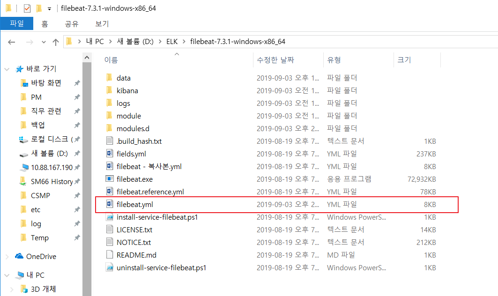

<h1> FileBeat 설치 </h1>
<h3> https://www.elastic.co/kr/downloads/ </h3>
Filebeat - Logstash - Elastic Search - Kibana (ELK 스택)은 모두 해당 사이트에서 다운 가능

1. 설치 파일 준비 및 다운로드. 
2. filebeat.yml 수정 ( config ) 

2-1. Input 수정
> type : 읽어올 파일 타입 (.log) 지정 및 파일 경로 설정
-- 라인 정리 및 그림 넣기 내일하즈아~~
